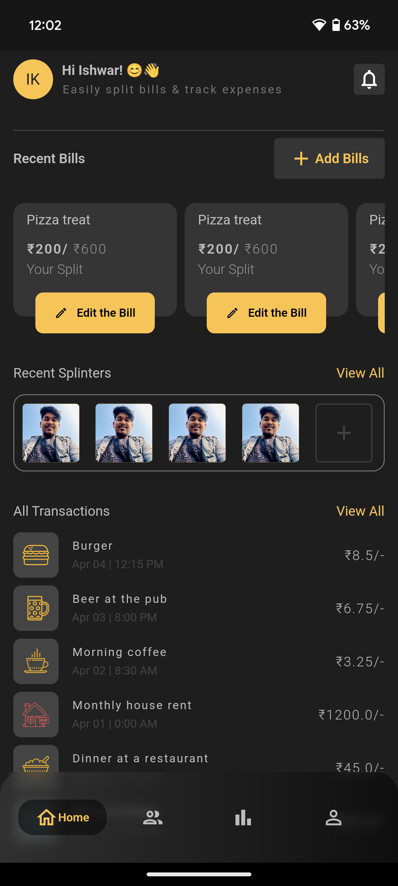
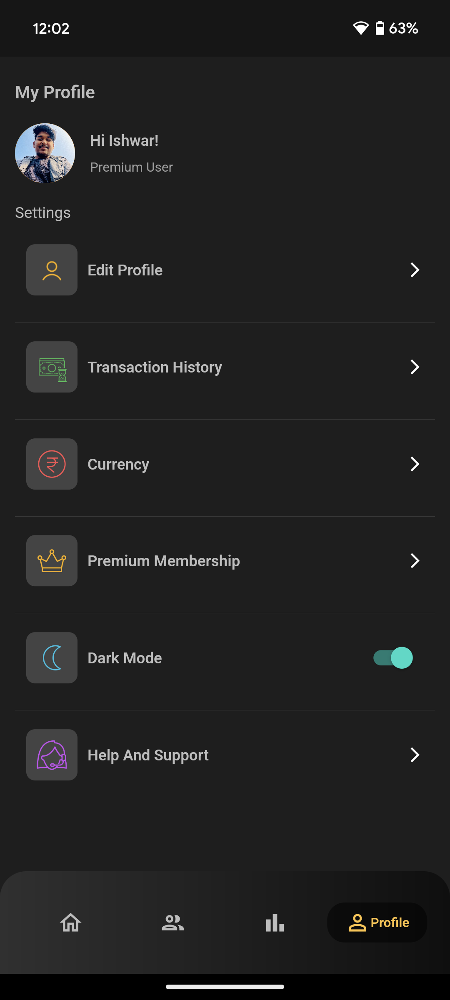
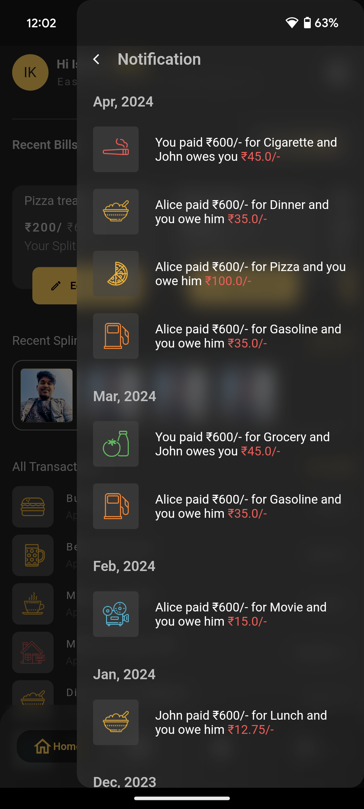

# FairShare App

FairShare is an innovative mobile application designed to simplify and streamline the process of sharing expenses among friends, family, or roommates. Built entirely with Flutter, FairShare provides a user-friendly interface and robust functionality to ensure fair and transparent expense management.

## Features

- **User-Friendly Interface:** Intuitive design for easy navigation and use.
- **Expense Tracking:** Add, edit, and manage shared expenses effortlessly.
- **Expense Splitting:** Automatically splits expenses among group members.
- **Notifications:** Stay informed with notifications for new expenses and payments.
- **Reports:** Generate detailed reports to review and analyze shared expenses.
- **Secure:** Your data is stored securely and is accessible only to authorized users.

## Screenshots





## Installation

To run the FairShare app locally, follow these steps:

1. **Clone the repository:**
    ```bash
    git clone https://github.com/nextishwar/fairshare.git
    ```
2. **Navigate to the project directory:**
    ```bash
    cd fairshare
    ```
3. **Install dependencies:**
    ```bash
    flutter pub get
    ```
4. **Run the app:**
    ```bash
    flutter run
    ```

## Usage

1. **Create an Account:** Sign up with your email and password.
2. **Create a Group:** Create a group for your friends, family, or roommates.
3. **Add Expenses:** Add shared expenses with details and participants.
4. **Split Expenses:** FairShare will automatically split the expenses among the participants.
5. **Settle Up:** Keep track of who owes whom and settle up easily.

## Contributing

We welcome contributions to enhance the FairShare app! If you have any ideas, suggestions, or bug reports, please open an issue or submit a pull request. Follow these steps to contribute:

1. Fork the repository.
2. Create a new branch with a descriptive name.
3. Make your changes and commit them with clear messages.
4. Push your branch to your fork.
5. Submit a pull request to the `main` branch.


## Support

If you find this project useful, please consider giving it a ⭐️ on [GitHub](https://github.com/nextishwar/fairshare). Your support is greatly appreciated!

## Contact

For any questions or feedback, feel free to reach out:

- Email: nextishwar@gmail.com
- GitHub: [nextishwar](https://github.com/nextishwar)

---

Thank you for checking out FairShare! Let's make expense sharing fair and easy together! 🚀